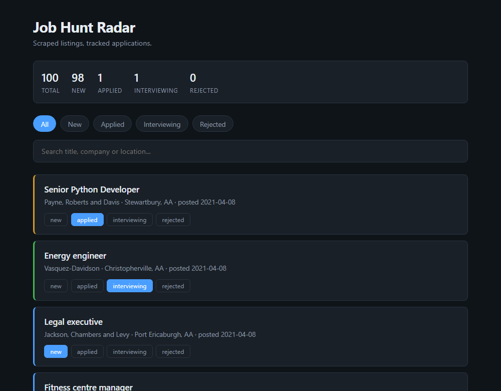

# Job Hunt Radar

An app that automatically collects job listings, scores them against what I want,
and tracks my applications.

Built while learning TypeScript. Currently at **v2.5**.



---

## Running it

```bash
npm start           # start the web app, then open http://localhost:3000
npm run scrape      # fetch new listings into the database
npm run build       # compile the React front end into public/
npm run dev         # front-end dev server with instant reload (needs npm start too)
npm run typecheck   # check for type errors
```

`npm start` serves whatever is in `public/`. That folder is **generated** by
`npm run build`, so run the build after changing anything under `web/`.

While actually writing front-end code, run both: `npm start` in one terminal
for the API, `npm run dev` in another. Saving a file updates the browser
instantly, with no rebuild and no refresh.

If `npm run scrape` fails the very first time, run this once:

```bash
npx playwright install chromium
```

---

## Choosing a browser

Near the top of `src/scrape.ts`:

```ts
const USE_EDGE = false;      // true = use my installed Microsoft Edge
const SHOW_BROWSER = false;  // true = watch the browser window while it works
```

**Default (recommended):** Playwright's own bundled Chromium. It was downloaded by
`npx playwright install chromium` and lives in `AppData\Local\ms-playwright`.
It is completely separate from the Chrome/Edge I browse with — that is the point.
Same behaviour on every machine.

**Using Edge instead:** set `USE_EDGE = true`. It works, but only with a visible
window. This machine's Edge is locked down by a system policy:

```
ERROR: Headless mode is disallowed by the system admin.
```

The code forces Edge to visible mode automatically so it doesn't crash.

---

## Troubleshooting

| Problem | Fix |
|---|---|
| `Executable doesn't exist` | Run `npx playwright install chromium` |
| `Headless mode is disallowed by the system admin` | You set `USE_EDGE = true` — either set it back to `false`, or leave it visible |
| Scraper finds 0 jobs | The site's HTML changed. Set `SHOW_BROWSER = true` and watch what actually loads |
| Red squiggles in editor but it runs fine | Type errors. Run `npm run typecheck` to see them all |

---

## What's here so far

```
job-hunt-radar/
├── src/                     <- the back end (runs on Node)
│   ├── main.ts        <- the scraper run. `npm run scrape` starts here.
│   ├── scrape.ts      <- gets jobs off the website. Nothing else.
│   ├── db.ts          <- saves jobs, tracks status. Nothing else.
│   └── server.ts      <- the web server + API. `npm start` starts here.
├── web/                     <- the front end source (React)
│   ├── index.html     <- an empty shell; React fills it in
│   └── src/
│       ├── main.tsx        <- hands the page over to React
│       ├── App.tsx         <- holds all the state, decides what's on screen
│       ├── types.ts        <- shared types, mirrors the API's shape
│       ├── styles.css      <- how it looks
│       └── components/
│           ├── StatsBar.tsx   <- the counts row
│           ├── Filters.tsx    <- the filter pills
│           ├── SearchBox.tsx  <- the search field
│           └── JobCard.tsx    <- one job listing (used 100 times)
├── public/                  <- BUILT OUTPUT. Generated, not hand-written.
├── legacy-vanilla/          <- the v2 front end, kept for comparison
├── jobs.db            <- the database (created on first run, git-ignored)
├── vite.config.ts     <- how the front end gets built
├── package.json       <- dependencies and the npm run commands
├── tsconfig.json      <- TypeScript settings
└── .gitignore         <- files git should ignore
```

Each file has one responsibility. Change how scraping works and only
`scrape.ts` is touched. Change how the page looks and only `styles.css` is.

**Back end dependencies: Playwright and TypeScript. That's it.** The database
is `node:sqlite` and the web server is `node:http` — both built into Node 24.

The front end adds React and Vite. None of it reaches the server: Vite compiles
everything down to plain files in `public/`, which `node:http` serves as-is.

### Why `legacy-vanilla/` is still here

That folder is the same app written by hand — no React, no build step. It works.
Compare `legacy-vanilla/app.js` with `web/src/App.tsx` and the difference is
that the hand-written one calls `render()` after every single change, and
forgetting one call leaves the screen quietly wrong. React removes that whole
class of bug: describe what the screen should look like for the current data,
and it works out what to update.

Worth reading in that order. React makes no sense until you've felt the problem.

---

## What it does now

**Terminal** — `npm run scrape`
```
Run 1:  100 NEW jobs
Run 2:  No new jobs since last run.
```

**Browser** — `npm start` → http://localhost:3000
- Browse every listing found
- Mark each one: new / applied / interviewing / rejected
- Filter by status, search by title, company or location
- Counts update live; everything persists in SQLite

### The API

| Method | Route | Does |
|---|---|---|
| `GET` | `/api/jobs` | all jobs + status counts, as JSON |
| `POST` | `/api/status` | change one job's status |

Status values are validated **on the server** — the browser can't be trusted,
because anyone can open devtools and post whatever they like.

---

## The build plan

Each version works on its own. Finish one before starting the next.

| Version | What it adds | What I learn |
|---------|--------------|--------------|
| **v0** ✅ | Scrape one site, print to terminal | JavaScript basics, Playwright, selectors |
| **v1** ✅ | Save to a database, detect new listings | SQL, primary keys, transactions, migrations |
| **v2** ✅ | Web page to browse and track applications | HTTP servers, APIs, DOM, fetch, XSS |
| **v2.5** ← here | Same page rebuilt in React | components, state, props, effects |
| v3 | Runs automatically every morning, deployed online | scheduled jobs, deployment |
| v4 | Playwright tests, match scoring, stats chart | automated testing, algorithms |

---

## Rules I'm following when scraping

1. Check `robots.txt` before scraping any new site
2. Never scrape sites that forbid it in their terms (LinkedIn does)
3. Prefer an official API or RSS feed when one exists
4. Add a delay between requests — don't hammer anyone's server
5. Personal use only, don't republish someone else's data

---

## Notes to self

- `headless: false` in `scrape.ts` makes the browser visible. Best debugging tool there is.
- Errors are information, not failure. Read them properly before changing anything.
- Finish the exercises at the bottom of `scrape.ts` before moving to v1.
# job-hunt-radar
